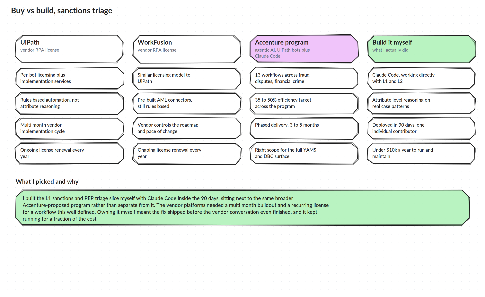

# Buy vs Build

## The options on the table

**UiPath.** A per-bot license plus implementation services. Rules based automation, not attribute level reasoning. A multi month implementation cycle and a license that renews every year.

**WorkFusion.** A similar licensing model to UiPath, with some pre-built AML connectors out of the box, still fundamentally rules based. The vendor controls the roadmap and the pace of change, and the license renews every year.

**The Accenture program.** An agentic AI operating model proposed across 13 workflows spanning fraud, disputes, and financial crime, combining UiPath bots with Claude Code for development, targeting 35 to 50 percent efficiency gains, delivered in phases over 3 to 5 months. This was the right scope for the full YAMS and DBC surface, and it is the program my pilot sits inside.

**Build it myself.** Take the highest volume, most repetitive slice, sanctions and PEP alert review, and build the triage logic directly with Claude Code, working next to the L1 and L2 team on real case patterns. No license, no vendor implementation calendar, no committee.

## What I picked and why

I built the sanctions and PEP triage slice myself. The vendor platforms needed a multi month buildout and a recurring license for a workflow that was already well understood and well scoped from the discovery work. Owning it myself meant the fix was running before the vendor conversation had even finished, and it kept running for a fraction of the cost, both in the license fee I never had to pay and in the ongoing maintenance.

## What it actually cost

- Vendor path (UiPath or WorkFusion licensing plus implementation for this workflow): the cost I avoided, more than $2,000,000 over 2 years
- What I built instead: running and maintained internally for under $10,000 a year

That gap is the whole argument for doing this piece myself instead of waiting on a vendor cycle built for a much bigger scope.

## Why the decision layer stays deterministic

The logic in this repo compares attributes and returns a decision with a written reason. It does not call a model to make that call, and that was not an oversight, it was the point. A sanctions decision has to be defensible to an auditor after the fact, which means the reason it closed has to be the same every time given the same inputs, and has to be explainable in one sentence without hedging. A model can be a great tool for surfacing a pattern a human should look at, but I did not want probabilistic judgment anywhere near the actual close decision on a regulated queue. Where the logic in this repo is genuinely intelligent is in what it treats as unambiguous versus what it routes to a person, not in guessing on the hard cases. That is a narrower, more conservative use of automation than a general purpose model, and it is the one I would defend in an audit.
