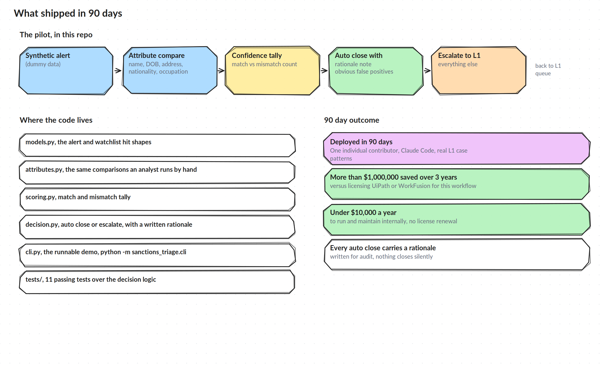

# The Pilot and the Outcome

## What it does

Every alert going through the pilot carries a screening record (the customer, transaction, vendor, or employee data that triggered the alert) and a watchlist hit (what Bridger matched it against). The pilot runs the same comparison an analyst runs by hand:

1. Compare name, date of birth, address, nationality, occupation, and entity type between the record and the hit
2. Tally how many of those attributes actually confirm a match, how many actively contradict it, and treat anything missing as unknown rather than as evidence either way
3. If the entity type itself does not match (a business flagged against a person, for instance), or if two or more attributes actively contradict the hit with nothing confirming it, close it as a false positive and write down exactly why
4. Everything else escalates to L1, unchanged from today, with a note explaining what was and was not confirmed

Nothing here closes a real or ambiguous match on its own, and nothing here removes a human from the harder cases. It removes the analyst minutes spent confirming the obvious ones.

## Where the code lives

- `src/sanctions_triage/models.py`, the alert and watchlist hit data shapes
- `src/sanctions_triage/attributes.py`, the attribute comparisons
- `src/sanctions_triage/scoring.py`, the match and mismatch tally
- `src/sanctions_triage/decision.py`, the close or escalate rule and the rationale text
- `src/sanctions_triage/cli.py`, a runnable demo over synthetic sample alerts
- `tests/`, 11 passing tests covering the comparison and decision logic

Run it with `python -m sanctions_triage.cli` from the `src` directory. Every alert it processes is invented, none of it is real Varo data.

## The 90 day outcome

- Deployed in 90 days, built and owned by one individual contributor with Claude Code, tested against real L1 and L2 case patterns
- More than $2,000,000 in cost avoided over 2 years, compared with licensing UiPath or WorkFusion for this workflow
- Runs today for under $10,000 a year to maintain internally, no license renewal
- Every auto closed alert carries a written rationale, so nothing closes silently and the audit trail holds up

## What this is not

This covers the front end review step only. It does not touch a confirmed true match, it does not file a SAR, and it does not replace L2 review, QA, or financial crime operations leadership on anything that needed a decision. It exists to protect the time those roles already had for the cases that actually needed it.
