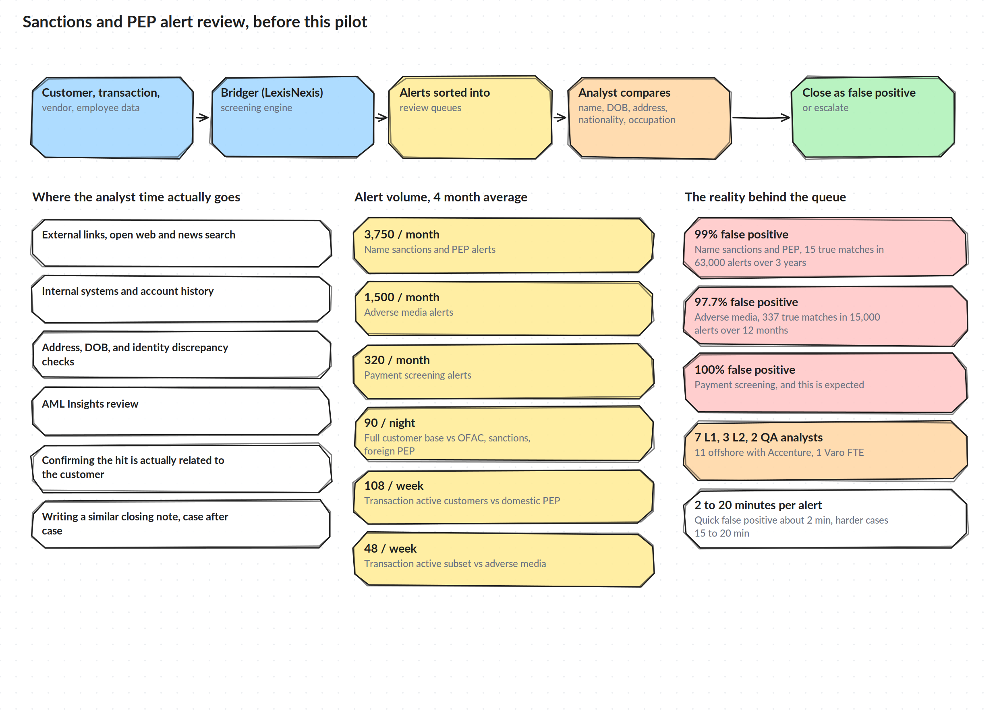

# The Problem

## Where alerts came from

Customer, transaction, vendor, and employee data got screened through Bridger (LexisNexis), which checked everything against OFAC and global sanctions lists, PEP lists, enforcement lists, and adverse media. Bridger sorted the results into review queues, and from there an analyst worked each alert by hand: comparing name, date of birth, address, nationality, occupation, and entity type against the watchlist hit, then closing it as a false positive or escalating it.

Confirmed referrals moved into Verafin for financial crime case management.

## The volume

Four month averages going into this pilot:

- Name sanctions and PEP alerts: 3,750 a month
- Adverse media alerts: 1,500 a month
- Payment screening alerts: 320 a month, also through Bridger

On top of that, ongoing screening ran on its own schedule: the full customer base got screened nightly against OFAC, sanctions, and foreign PEP lists (90 alerts a night), transaction active customers got screened weekly against domestic PEP lists (108 alerts a week), and a smaller transaction active subset got screened weekly against adverse media (48 alerts a week).

## Where the time actually went

The decision itself was usually fast. What took the time was the research behind it: pulling external links, searching open web and news sources, checking internal systems, resolving address and date of birth discrepancies, reviewing AML Insights, and confirming that a hit was actually connected to the customer in front of you. Then writing a closing note that looked a lot like the last one.

Review time ranged from about 2 minutes for an obvious false positive, to 5 to 10 minutes for a normal case, to 15 to 20 minutes for a harder one.

## The false positive rate

- Name sanctions and PEP: 99 percent false positive (15 true matches out of 63,000 alerts over 3 years)
- Adverse media: 97.7 percent false positive (337 true matches out of 15,000 alerts over 12 months)
- Payment screening: 100 percent false positive, and this was expected by design

## Staffing behind the queue

Review sat with 7 L1 analysts, 3 L2 analysts, and 2 QA analysts. Of that group, 11 were offshore through Accenture and 1 was a Varo FTE.

## Other manual work worth naming

Sanctions review was not the only high effort manual workflow the team pointed to. Three others came up directly:

1. Separating IAT transactions out of full ACH files for daily screening. This had been attempted before and had not been solved, and a dedicated daily automation for it would have been a real win on its own.
2. Financial crime customer messaging through Zendesk, a growing workflow that the team described as slow.
3. Monthly TPRM screening, which meant manually downloading and reformatting data out of Archer every month, an exercise with recurring data quality and formatting problems that ran a few hours each time.

I scoped this pilot specifically to the sanctions and PEP alert review step, since it was the highest volume, most repetitive, and most measurable piece to start with.
